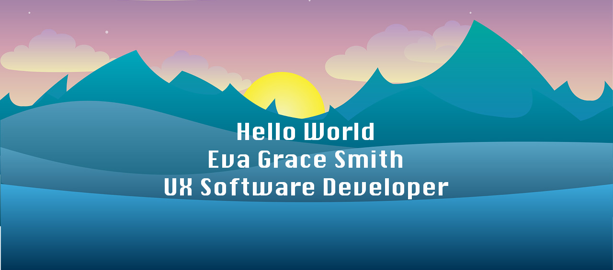

<!-- ### Hi there, I'm Eva Grace!  -->
<h2 align="center">Welcome to my GitHub! </h2>

#### I am a full-stack software developer, educator, mentor, and artist. You can find me coding, discussing code with my husband, listening to coding podcasts while walking our puppies, attending my daughter's soccer matches and swim meets, and enjoying a good cup of pour-over coffee. If you have caffeine, let's talk

#### 😄 Pronouns: She/Her

#### 🌱 I'm currently learning socket.io and AWS to enhance my server building skills

#### ⚡ My Passion: To use my talents and skills to make my corner of the world a better place

<!-- #### 💻 Check out these two Web Pages that I built and am most proud of:

     <h2>Holiday Helpers</h2>
<a href="https://holidayhelpers.github.io/holiday-helpers" target="_blank" rel="noreferrer">
     <h2>Odd Duck</h2>
     <a href="https://evagracesmith.github.io/odd-duck" target="_blank" rel="noreferrer"> -->

<!-- [Dev Portfolio](https://.github.io/) || [Artist Site](https://www..com/) -->

## Skills and Tools  

  
  

  
  
  
<!--    -->
<!--    -->
<!--    -->
<!--    -->
<!--    -->
  
  
  
      
    
   

   
   
    
    
    
    
    
    
    
    
    
     <a href="https://mantine.dev/" target="_blank" rel="noreferrer">
<img src="data:image/png;base64,iVBORw0KGgoAAAANSUhEUgAAAOEAAADhCAMAAAAJbSJIAAAAYFBMVEUzmvD///8tmPAblO+cyfcgle9Tp/IVku/U5/vw9/6r0fj0+f7g7vz2+/6KwPU5nfBHovG+2/l+uvTO5PtZqfLa6/yjzPdosPOSxPbJ4fpKo/F0tfTp8/2v0/h4t/S82vnqBxckAAALu0lEQVR4nOWdibajKBCGEYJkM5rExNys7/+WgxrjAkTQKqI9/zl9eqa7z9VPtqKqKEiArWi13K8Xl8MtDa9JTEgcJ9c0e+4Wj/1xG6E/PiCIPzs6PS5ZTBnjnFNKCcl/5aLyv6j8QyZonF5eJ8R3QCPcLNfPWAhJRnokUYW4Hh5omBiEx8WVC0574ZqcXJDsvER4GXDC+yOTdA5srcak2eMO/EKwhKdFwvr75fe2ZNczLCQc4f2cDGu8rri4nldgrwVG+EoZCF4Fmf0BvRgM4f1C2KjOqYoycoFpSADCv0yMG3wGRi5uEJPraMJXIhDw3pAsHd9ZRxK+YoaF92a8jmUcRbhH5iskRjKOIPxLBD6fFBXpGJNuMOE29dB+FSO7DZ9XBxJGO7z5Rc+48Ev44IDLu514PHA4DiHchn4GYEfiNmi/PIBw4beD1qLs5YPwHnrvoLVY5t6MroQPaAPUTZTvcQmj7CcjsInIdpiEJ/LTBizFE7cdsgvh+tcNWIoyp3XDgfA5DUApccEgXF1/OId2xTJ4wqWTcxBdPLE2VC0J95PpoW9Rbrv/tyOcyBzTlLWBY0V4mR6glHiAEe4mCSgRz0CET39bXUcJm01jP+FtQqtEVzb74l7CKQNaIfYRHibbRUv1d9Qewt3EASXiehThNJeJtvoWja+EE1zoNerZanwjnJypZhDbDiQ8zQRQ6psZbiZc/fq17UWTQYTJpLZL38VvAwifk17pu/piopoI15NfCNsSR0fC7cwACaUbN8L412/sLJo6ER5mNQhLmYxwLeF+bn20kNB7bnSEK4zkEQ+KrQmzeQISfrAknNtCUUu7ZKiEq9kC6vupSjjXPpqLa0JvCuHfjJtQ9lN1I6UQ/vodx0mz7ncJL7BrfZGozzxGxoXi6+8Q3mF3vez5J83F1T71xkjVTtn+3xvkm9DkMyr+vMXHedd4axMuIacZGjZ+cpT6MnX56hthCvilKWnnvvhyvdKOZdMi/IMchUp8z5dvkrVzNVqEIeBz1CEvl1ovg5G2nTbN9wBtwm5nyXXyMxbby36TMIT8xFwXT9h6QaRPA+ERdJxwbZh966WftkZigxDW5Ob6gMnWx+66ZYDXhCfY2ZwaMuyW5ukGjp01Fqqa8AD7cTVzaam/a2gQATt7wxsO4s97RNCr1YCE3vsCKvOqsRX+EJ6hp7muTWOlDZBxJ+pE2w8hvA+4ZZdaCyYzorFPrAhhl4r3Y+zT6xpKQJ4tPo+uCEG3TZXs0+saOoLM6fUm6k0Y4Rj+1DL3DKERP0HTN+ELy5xySuctBeNIEdVpsDchngtRaB3R3wTztT8WR0mI6QVmTzOMVjBxIUpbhA9Mm585tiLQiKlCUSUhrp/bcSzuYF6GXxqEEfK2rTf3rKUY6HMnDUL0iKgheKkV2Mu8t/oFIfC2QhWl1tbNBuzYw3uDQSD7hVnGPAJFcK6U9zNzwq0HNx+zyjoPTpAfm0cV4dqHf+h7AmGh1d8NdEJgx4rQS0xU108j0RawP7VcL3JCP1ETNe4FHsvrqPyoxM8wLKQSAgfzumJvQrR9RUdcM9lAhoJUFfsLAmYl9YuphKgGcemzJbDxmO8PVBtxgzsQDyWht3RunQsVdx5PCkKPqaQaFypuN6VRTugxEVHjX8SdTXMzgwQLj7mkGsMGxu9kUF6BgeD4EXNPoqZyopIogTyT588jKB+Ri/CwWO9uvFsGRT0YgTpI8lgpQbDZeLyuQpTHZ9vWVPPO7qjTgBz4ZAP+hPbZh22r2osm9o25Oc3XJwJtlVLSbabmQWmqFkNAXRGFJITOttT4Ky6NR1Dlb1Hncjl5E2C7W+hKqzWma3Ug7lEJjwGBjYxqlgOpqF431BSNJeaaLxdEcgHNRjQE72s/iZrAsEIlfAQEdMXVN2HeiNW/0Ew1mL1UbmfIE5LQ6G6qR6K65mPabfwSkAzw51H9qZWguYVQt8GY+3y5QySg+YjG0j91aq5QTtFhLoj0FpArZNKssdJYvUlSOzJmTEF+cwJ53NdMWE+YapAGmxAyj4YaDxzXtiFTziZh7p9oCktIjDlCtW2oVkBAJQxhj8gYs/UaxqdKiOr4DoHb0Fii4lr/E6+9FJyQGvIuGranSog600CPQ93ZsVyNJU/dfGATwhaH0Md6m0VSmFK5EskVVr5PBmvTEP1Z3Hsz9Vcof41qtd1g7dJcauGmVXMgaKbbq/FnjVdul4L3EdFZ9o+txUB3BBKzDeXeAn6c86RR63e1a7sT1aM04AnmrXdZAO/x3xLX82kVBJv7/tANzavuRNQQtHwcsJ/m85PzG3W45loddTlEPVrN9uC+tj5xZXuI84nfYkt4f2mPrspEg7kcFv5Sb5kYhbiaiIkaXhNRQPwWiVD3vyvcIDBO7OnLA3UHSzEfmMeeUE2KrjQHS1HDFmX8EHWkd6Qpr4KaM1TGgD3G8TWdFNWiKaIkxFvSF9GmDOFmguSbUeKzACRTY4u4Cdi5feE1J0qzd8SdycucKH95bUK9mAJ3rajy2tAz9ZvP6wh3Ii82MgQ7tayW6qHBOhRYqbCg/OUIa0xS7Bz6KkfYj92m9YfHgjXkdsGuxSOrPG8/ufpCc41RdFw29doR2LSJT66+j/MW3O4U4hnyQEIZY/B1Zsb2tpcTYN2M+syMh4Fof3gNrlRV49xTAJqPoZPlqadCYMG25tk17ERofdlNg8DWyOb5Q2RPhmP5CCg75536Us4AqNtQmriVAAGa2qu0CQL5Q/VPih1rnAAlK1a+55IQ8UyAe/kPGMKPDfX+Ha2b8tC5Sg2ME7xTUwFtfyEcroCrBPO1WbUCo9Y2oVYXMnUENGK6tU1wtqJuVzG+BbMPUOrToNQYIm7XaZY6w7yIWmMIoU4UG3JfOBCgpk4UfBjPlBH9TUuo68xFPT4Q67UZKFaXhV6XQwK2O9TVawOvuWewtqOYmwS4M9TV3IM+S2qoDBlA5iQbpa+bCF37Un+9tJeCyYbal17ql/qpCG2qXwobK9W5Rz0BtpOx0eoIa25i2ODXwSnUjo+0fGCgjci6zqe7p4yBThovXj3vru/CW+LOt3resNvE9nUai+6hZyx9rckOW1efiBoxyryl7XQDzZh3I3zyMDdrf/eW99yNAH52nPH0+Qw1OYpY6r3fAv54B/V77XzvHSVB4PeFoKVxPiuE87xzrZLNXUH//n1P/4M7u4LHfG7J7UjofHv/1N152ki69v7DmfZT+/sPg9csER3usMROxsKRyXupJ4xmeJesKdD879wHbApTmvJcHjNDdL7TeW5XAg+4l9uT6xZIg+5WDza/fm17UfU0lQ2hv9q04/UtGeJbRt1+HojUcETegtDbfX7j1BNL/54VuZsBoq7GtD1hcJj8sth770JfZutz4ssi642l9+buwtwwhSWLy0H6s5OnjCiMZZtcCIPnZMcis7nexSbD/DDRGdUK0IpwoouG5e01dqcEgDKVIEVt71e0PAcxPQNOLT8xjjA4TSueQeP+K08cCYNVMqFVg6f2mcfWhEGQTaan2iyDQwiD8zQWRus5xp0wWPqsMGEST9wSc50Ig+j3PdX1Jj5Hwnxl/GkzUn26HCRhsP3lnCoy99tpnQk95v50RdmAe1uHEAb39CejcUgDDiTMff7em5HHQw5vDCYMooPfrkrtdkqAhNJQDf11VcpuQw6njCSU+43Yk43DwgGXX0MQyuHog1Ek+px4L4T4jJRdx/GNJgyCV4I351CWDpxAIQmD4C8VGNtjysVtyNmwrgAIpSW3o9ALJGXxYtACrwiEUK6Pr5TB2auy+dKxw+8jIEKp+yIREJASL1zDNF8hOEKp0yIZmfBMOQvPw1d3nUAJpe6PjA9tSs549gBsvVLQhLmOl1BSusyvVLYdDy+2LlAnYRBKbZbrZyxsKj/lcILczkfnygSWQiIstFk+LllMGcvPh+asFS7NM/jlHzJG43S3PoL3zKYwCUtFq+V+vdgdbml4TWJC4ji5ptlzt3jsl3eshmvoP+rXhr3gSMY8AAAAAElFTkSuQmCC" alt="mantineui logo" width="40" height="40"/></a>
    
    
    

<!--  -->

  
___

   

## Connect with me 
 

  

 <h3 align="center">📫 smithevagrace@gmail.com </h3>
 
 
 

___

  

___

<a href="https://skyline.github.com/evagracesmith/2022">Check out this 3D image of my 2022 GitHub Commits!</a>

<!--
**EvaGraceSmith/EvaGraceSmith** is a ✨ _special_ ✨ repository because its `README.md` (this file) appears on your GitHub profile.

Here are some ideas to get you started:

- 🔭 I’m currently working on ...
- 🌱 I’m currently learning ...
- 👯 I’m looking to collaborate on ...
- 🤔 I’m looking for help with ...
- 💬 Ask me about ...
- 📫 How to reach me: ...
- 😄 Pronouns: ...
- ⚡ Fun fact: ...
-->
